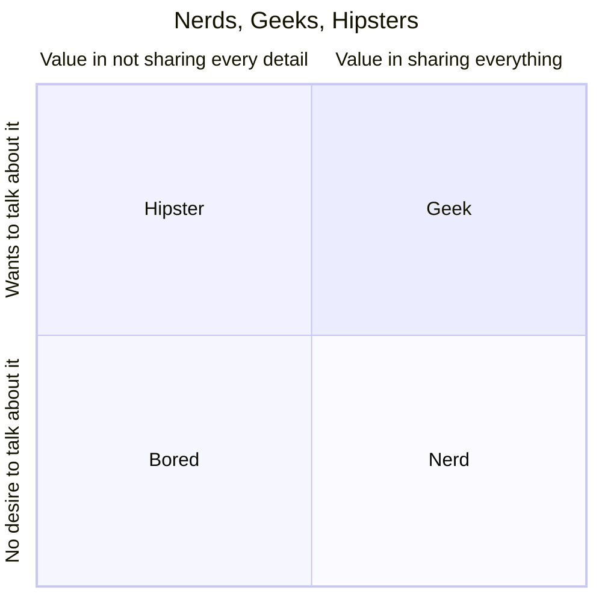

```mermaid
quadrantChart
    title Nerds, Geeks, Hipsters
    x-axis Value in not sharing every detail --> Value in sharing everything
    y-axis No desire to talk about it --> Wants to talk about it
    quadrant-1 Geek
    quadrant-2 Hipster
    quadrant-3 Bored
    quadrant-4 Nerd
```
